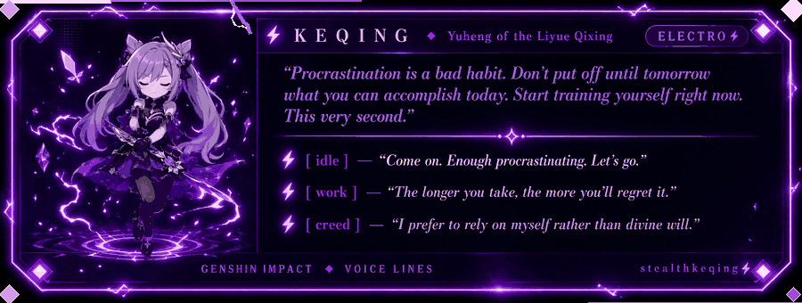

<div align="center">

<!-- ⚡ ANIMATED LIGHTNING BANNER SVG ⚡ -->


<!-- Typing SVG -->
[](https://git.io/typing-svg)

</div>

---


## `> whoami`

```yaml
name        : Arnav Bhargava
alias       : stealthkeqing ⚡
role        : AI/ML Engineer & Full-Stack Developer
current     : n8n Developer (Upcoming) · AI Trainer @ Deccan AI
focus       : LLM Apps · RAG Pipelines · Workflow Automation · GenAI
research    : Hiroshima University — Graduate School (2025–26)
education   : B.Tech CSE AI/ML @ VIT Bhopal — CGPA 7.91
achievements:
  - Published researcher (IJSRET Vol.9 Issue 2)
  - Product Hunt featured builder
  - HackerRank 5★ Gold Python
  - CTF 2nd Place, OWASP VIT Bhopal
  - Active contributor — GeeksForGeeks & LeetCode
  - CS50 · IBM AI · Meta · Google · DL.AI Certified
```

<!-- ⚡ KEQING PROCRASTINATION DIALOG BOX ⚡ -->
<div align="center">

</div>

---

## `> cat skills.json`

<table>
<tr>
<td valign="top" width="50%">

### ⚡ ML / AI / LLM


`RAG` `LLM Fine-tuning` `Multi-Modal AI` `Prompt Engineering`

</td>
<td valign="top" width="50%">

### 🌐 Backend & Web


`JavaScript` `SQL` `R` `Web Scraping`

</td>
</tr>
<tr>
<td valign="top">

### 💾 Databases & Cloud


</td>
<td valign="top">

### 🛠 DevOps & Tools


`Pandas` `Web Scraping`

</td>
</tr>
</table>

---

## `> ls projects/`

| Project | Stack | Highlight |
|---|---|---|
| ⚡ **[Turmix Vibe](https://github.com/Arnav1771)** — Discord MVP Bot | Gemini 2.0 · GPT-4o · Qwen | Production-ready MVPs in **< 5 min** · auto Docker + README |
| 🚀 **[GuiltHub](https://www.producthunt.com/products/guilthub)** — AI Project Showcase | Next.js 14 · TypeScript · Prisma · PostgreSQL | **Featured on Product Hunt** at launch |
| 🔐 **[Temp Repo](https://temp-repo-ecru.vercel.app/)** — GitHub Repo Link System | Vercel · Token Auth | Secure time-limited repo access with auto-expiry |
| 🧩 **Cross-Browser Tabs Manager** | WebExtensions API | Chrome + Firefox · tab grouping · session restore |

---

## `> cat experience.log`

```
[2025-12 → NOW]  AI Trainer            @ Deccan AI
                 └─ Evaluating model outputs · identifying failure modes

[UPCOMING]       n8n Developer
                 └─ Workflow automation · agentic pipelines

[2025-06 → SEP]  Generative AI Dev     @ Aligned Automation (Intern)
                 └─ Multi-model AI apps (Gemini 2.0, GPT-4o, Qwen 3.5)
                 └─ ~30% API cost reduction via intelligent fallback switching
                 └─ 50% less manual processing time via n8n automation

[2024-07 → 2025] Data Analyst          @ Call N Collect Pvt Ltd
                 └─ Python/Pandas pipelines · 40% faster processing
                 └─ Real-time KPI dashboards

[2023-09 → 2024] Quality Engineer      @ Naviwise (Intern)
                 └─ 80+ bugs documented via JIRA
```

---

## `> stats --live`

<div align="center">


[](https://git.io/streak-stats)


<!-- Contribution Snake (requires GitHub Action setup — see note below) -->
<picture>
  <source media="(prefers-color-scheme: dark)" srcset="https://raw.githubusercontent.com/Arnav1771/Arnav1771/output/github-contribution-grid-snake-dark.svg" />
  <source media="(prefers-color-scheme: light)" srcset="https://raw.githubusercontent.com/Arnav1771/Arnav1771/output/github-contribution-grid-snake.svg" />
  
</picture>

</div>

---

## `> connect --all`

<div align="center">

| Platform | Link |
|---|---|
| 📧 **Email** | [arnavbhargava57@gmail.com](mailto:arnavbhargava57@gmail.com) |
| 💼 **LinkedIn** | [arnav-bhargava-845457280](https://www.linkedin.com/in/arnav-bhargava-845457280/) |
| 🐙 **GitHub** | [Arnav1771](https://github.com/Arnav1771) |
| 🎮 **LeetCode** | [Arnav1771](https://leetcode.com/u/Arnav1771/) |
| 💬 **Discord** | `stealthkeqing` — [Join my server ⚡](https://discord.gg/A6naZGm27J) |

[](mailto:arnavbhargava57@gmail.com)
[](https://www.linkedin.com/in/arnav-bhargava-845457280/)
[](https://github.com/Arnav1771)
[](https://leetcode.com/u/Arnav1771/)
[](https://discord.gg/A6naZGm27J)


</div>

---

<!-- ⚡ FOOTER WAVE ⚡ -->

